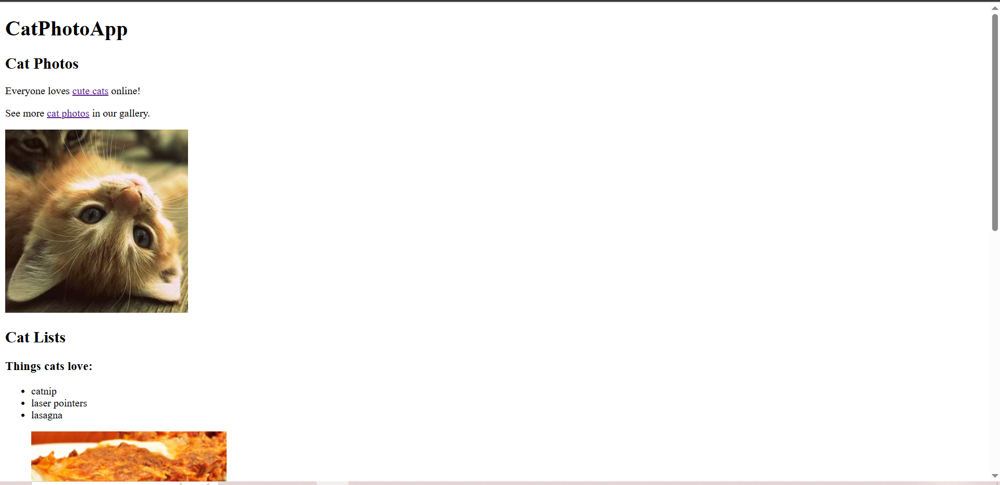
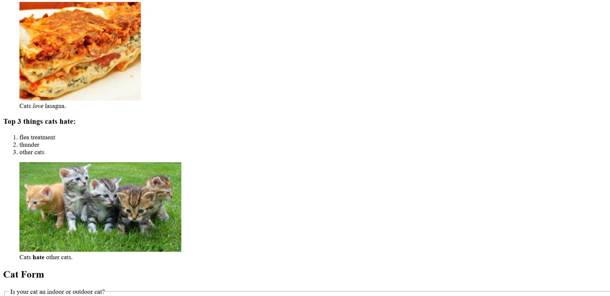
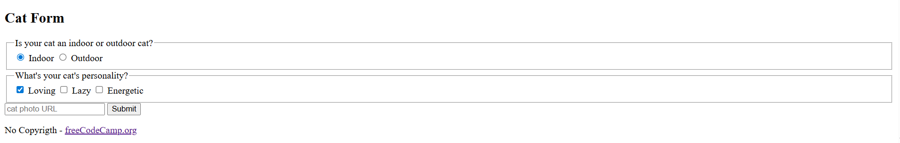

## Principais Conceitos de HTML - CatPhotoApp (FreeCodeCamp)

Este documento resume os principais conceitos de HTML aprendidos no módulo "Building a CatPhotoApp" do curso "Responsive Web Design" da FreeCodeCamp.

---

### Estrutura e Sintaxe Básica do HTML

* **Tags HTML:** Dão estrutura a uma página web, permitindo adicionar elementos como fotos, botões, etc.
* **Tags de Abertura e Fechamento:** Elementos HTML possuem uma tag de abertura (ex: `<h1>`) e uma tag de fechamento (ex: `</h1>`). O conteúdo do elemento fica entre essas tags.
* **Elementos Vazios (Void Elements):** Elementos sem tag de fechamento, como `` e `<input>`.
* **Aninhamento (Nesting) e Indentação:** Colocar elementos uns dentro dos outros (aninhamento). Para legibilidade, elementos aninhados devem ser indentados com dois espaços à direita do elemento pai.

### Elementos HTML Essenciais

* **Títulos (`<h1>` a `<h6>`):** Indicam a importância do conteúdo. Quanto menor o número, maior a importância. Recomenda-se um único `<h1>` por página.
* **Parágrafos (`
`):** Usados para criar parágrafos de texto.
* **Comentários (`<!-- -->`):** Permitem deixar mensagens no código sem afetar a exibição no navegador.
* **Elementos Semânticos (HTML5):** Melhoram a leitura do HTML, SEO e acessibilidade.
    * `<main>`: Representa o conteúdo principal e exclusivo de um documento.
    * `<section>`: Define seções de um documento (capítulos, cabeçalhos, rodapés).
    * `<footer>`: Define o rodapé de um documento ou seção, contendo informações sobre autor, direitos autorais, etc.
* **Imagens (``):** Adiciona imagens a um site.
    * **Atributo `src`:** Especifica a URL da imagem.
    * **Atributo `alt`:** Essencial para acessibilidade, lido por leitores de tela e exibido se a imagem não carregar.
* **Links (`<a>` - Âncora):** Cria links para outras páginas.
    * O texto do link fica entre as tags `<a>`.
    * **Atributo `target="_blank"`:** Abre o link em uma nova aba/janela.
* **Listas (`<ul>`, `<ol>`, `<li>`):**
    * `<ul>`: Lista não ordenada (sem numeração).
    * `<ol>`: Lista ordenada (numerada).
    * `<li>`: Item de lista.
* **Figuras e Legendas (`<figure>`, `<figcaption>`):**
    * `<figure>`: Conteúdo independente que pode associar uma imagem a uma legenda.
    * `<figcaption>`: Adiciona uma legenda à imagem dentro de `<figure>`.
* **Ênfase e Importância (`<em>`, `<strong>`):**
    * `<em>`: Dá ênfase a uma palavra/frase.
    * `<strong>`: Indica grande importância ou urgência.

### Formulários HTML

* **Elemento `<form>`:** Usado para obter informações do usuário.
    * **Atributo `action`:** Indica para onde os dados do formulário devem ser enviados.
* **Elemento `<input>`:** Permite diversas formas de coleta de dados.
    * **Atributo `type`:** Define o tipo de entrada (ex: `password`, `reset`, `file`).
    * **Atributo `name`:** Usado para que os dados sejam acessados pelo `action` do formulário.
    * **Atributo `placeholder`:** Fornece uma dica sobre a informação esperada no campo.
    * **Atributo `required`:** Impede o envio do formulário se o campo obrigatório estiver vazio. Não precisa de valor.
* **Elemento `<button>`:** Cria um botão clicável.
    * Comportamento padrão é enviar o formulário.
    * `type="submit"`: Clarifica que é um botão de envio.
    * `<input>` e `<button>` são elementos inline.
* **Radio Buttons:** Usuário escolhe apenas uma opção entre várias; ao selecionar um, os outros do grupo são desmarcados.
* **Caixas de Seleção (Checkboxes):** Usuário pode marcar múltiplas opções.
* **Elemento `<label>`:** Associa o texto a um elemento `<input>` para acessibilidade.
    * Pode-se aninhar o texto ou usar `for` no `<label>` com o `id` do `<input>`.
* **Atributo `id`:** Identifica elementos HTML específicos; o valor deve ser único na página.
* **Atributo `value`:** Valor real enviado ao servidor quando o formulário é submetido, associado ao `name`.
* **Atributo `checked`:** Faz com que um checkbox ou radio button esteja selecionado por padrão. Não precisa de valor.
* **Elemento `<fieldset>`:** Agrupa inputs e labels relacionados em um formulário. É um elemento de bloco.
* **Elemento `<legend>`:** Legenda para o conteúdo dentro do `<fieldset>`, fornecendo contexto.

### Estrutura Geral da Página

* **Elemento `<body>`:** Contém todo o conteúdo visível da página.
* **Elemento `<head>`:** Contém metadados (informações sobre a página que não são exibidas diretamente), como o título, links para CSS e scripts.
* **Elemento `<title>`:** Determina o que é exibido na aba ou barra de título do navegador.
* **Elemento `<html>`:** Elemento raiz da página HTML, engloba todo o conteúdo.
    * **Atributo `lang`:** Especifica o idioma da página.
* **`<!DOCTYPE html>`:** Declaração que informa ao navegador que o documento é HTML5 e garante a conformidade com padrões.
* **Elemento `<meta>`:** Usado para definir o comportamento do navegador.
    * `charset="utf-8"`: Informa ao navegador como codificar os caracteres da página.
    * É um elemento void.

### Imagens do Sistema

Aqui estão algumas imagens que ilustram o sistema CatPhotoApp:

* **Visão Geral da Aplicação:**
    
* **Exemplo de Formulário:**
    
* **Detalhe de Elementos HTML:**
    